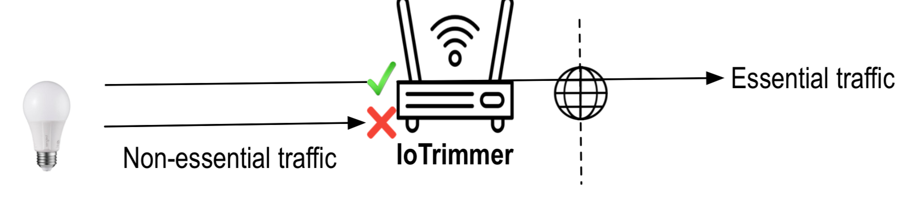

# IoTrim List
This site contains a set of non-required destinations list from 31 consumer IoT devices. The list is created using a methodology for determining non-required destinations by automatically executing IoT device functions and determining the execution outcome while blocking selected destinations.

Initial results of our paper can be found at https://arxiv.org/abs/2003.07133

## IoT devices functionality

IoT devices offer multiple types of functionality; however, for this list, we select only the main function for every IoT device under test so that we can have more coverage by devices rather than by functionality. However, from preliminary experiments we have seen that most devices use the same destinations for different functions. 

The list contains 4 columns: 

* device: the device under test
* destination: the non-required destination 
* party: destination’s party type (first party, third, support)
     - First party: destination related to the device manufacturer.
     - Support party: destination that is not a first party and is responsible for providing remote computation.
     - Third party: destination that is not a First party or a Support party. 
* grouped: to facilitate analysis and streamline blocklists, we developed a strategy to group destinations thet use different DNS names and IP addresses for each replica. 
